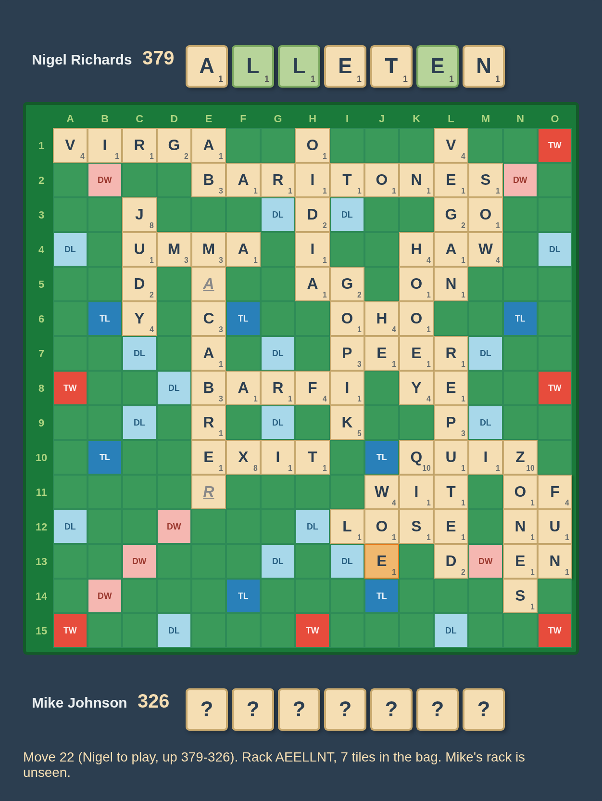
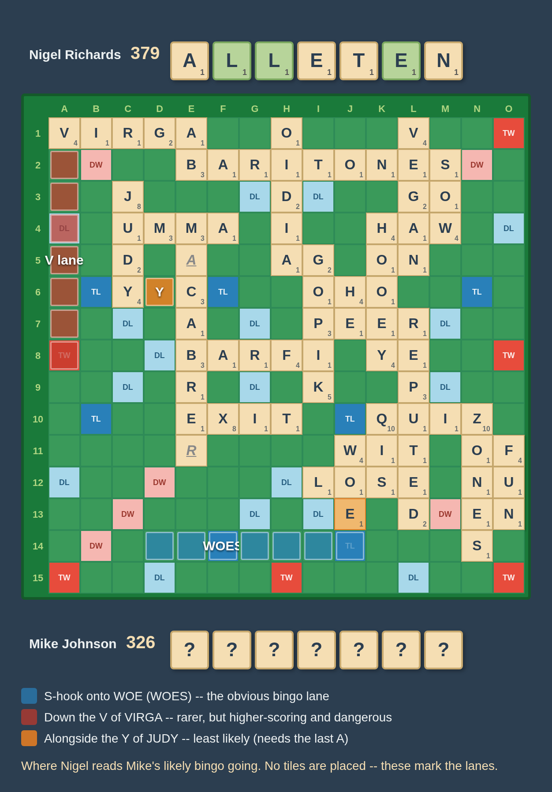
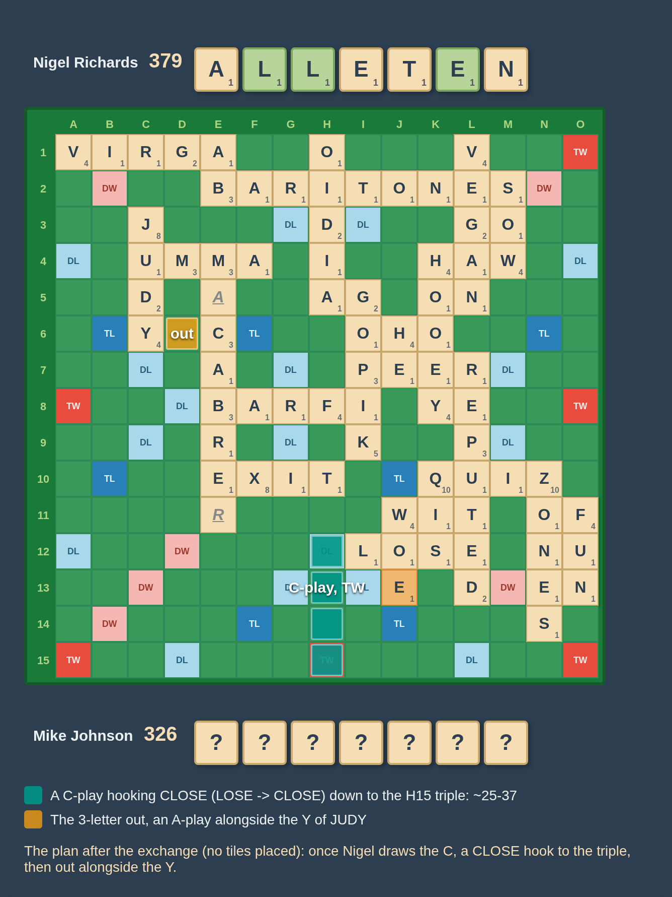
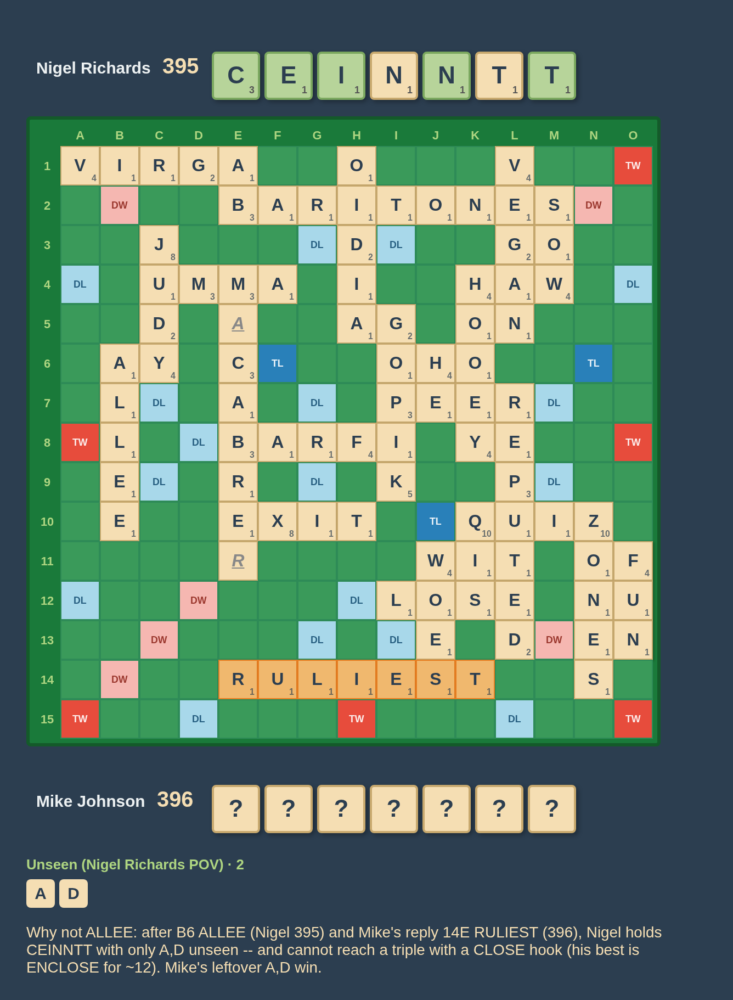
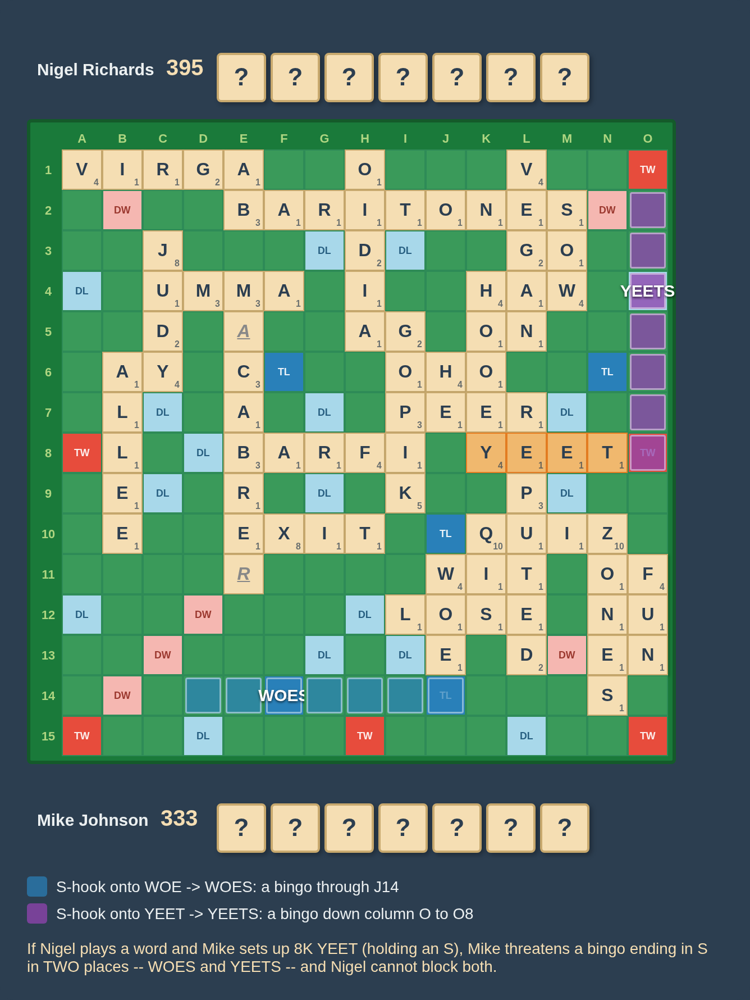
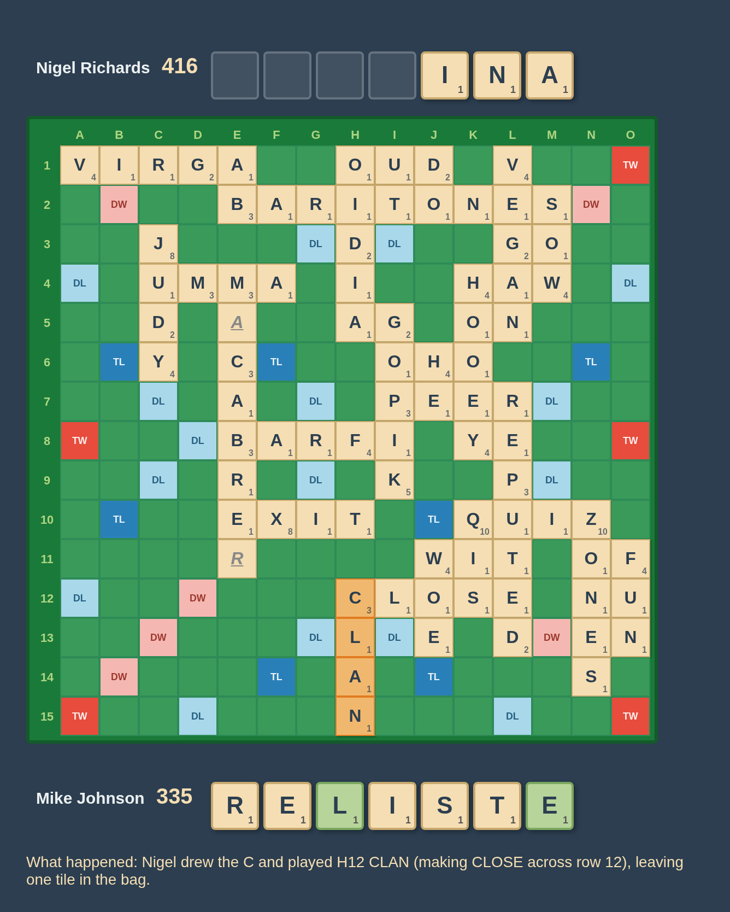
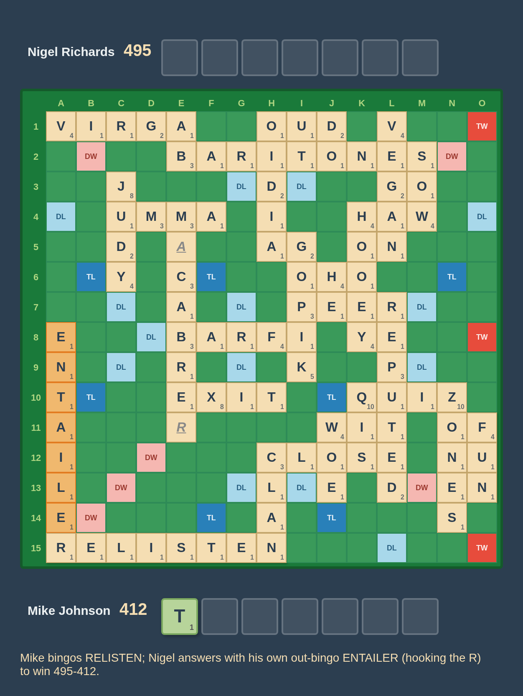

# Nigel Richards's EELLT exchange

**Richards vs. Johnson — 2025 World Cup, Round 11, move 22**

One of the most talked-about plays of the 2025 World Cup. Facing expert Mike
Johnson and up by 53, Nigel Richards passed over every scoring play — including
the engine's clear favorite, **ALLEE** — and instead **exchanged five tiles**,
throwing back **EELLT** and keeping only **AN**. No engine setting approves of
it (Macondo ranks it anywhere from 12th to 40th). This is an attempt to explain
why it may nonetheless be the winning play.

The board images below are rendered by this repo's own board renderer (the
manual GCG tool's `--dump-gcg` state dump feeding the `?tool=render` harness —
see [Reproducing the images](#reproducing-the-images)).

Credit for the analysis goes to Will Anderson and his fellow commentators
Morris Greenberg, Rafi Stern, and Josh Sokol in [his YouTube breakdown of this
game](https://www.youtube.com/watch?v=p94DqHv3xk8); the game itself is
[annotated on cross-tables](https://www.cross-tables.com/annotated.php?u=55430).

## The position



- **Nigel Richards: 379, on turn. Mike Johnson: 326.** Nigel leads by 53.
- **Nigel's rack: A E E L L N T.**
- **7 tiles remain in the bag**, so there are **14 tiles unseen** from Nigel's
  perspective (7 in the bag + 7 on Mike's rack).
- The unseen pool is **extremely bingo-prone**: every tile worth 4+ points is
  already on the board. Only the **C** and **D** are worth more than a point,
  and both are strong bingo letters.
- The engine's clear favorite is **B6 ALLEE** for 16.

Nigel exchanged **EELLT**, keeping **AN**.

## Reading the position first

The move only makes sense on top of two reads that Nigel makes *before* he
weighs any play. Both come from Mike's last two turns — **N10 ZONES** (28) then
**J11 WOE** (6).

### 1. Mike is very likely about to bingo

An expert who plays a one-tile move like WOE is almost always holding a
bingo-prone rack for next turn, and here the unseen tiles make that conclusion
even stronger. WOE also reads as a deliberate **S-hook setup** (WOE → WOES) on
a board that otherwise has none. So Nigel should expect a bingo, most likely:

- **hooking an S onto WOE → WOES** (the obvious lane WOE just created), or
- down the **V of VIRGA** — less likely, but higher-scoring and dangerous,
  giving Nigel little counterplay, or
- alongside the **Y of JUDY** — least likely, since it needs the last **A**.[^minor]



### 2. The C is very likely still in the bag

If Mike had held the **C** on his ZONES turn, he would have likely played
**CONE (37)**, keeping his S — not ZONES. And if he drew the C *after* ZONES, he
likely would have played a move like **H12 CITE (37)** instead of WOE. So if
Mike has a C at all, he likely drew it after his 1-tile WOE play; we can
conclude the C is **highly likely still in the bag**, and Nigel is very likely
to draw it.

With those two reads in hand, the logic of the exchange falls out.

## The core logic of the exchange

When you are winning by a large margin, the decision that matters is the
worst case: **"how could I lose this game?"** Here the loss scenario is clear —
Mike bingos, and then gets out before Nigel can catch up. Every candidate has
to be judged against that.

### Playing a move like B6 ALLEE helps Mike's timing

Playing a scoring word draws Nigel back up to 7 and leaves only **2 tiles in
the bag**. After Mike's expected bingo, Mike is then left with just **2 tiles**.
This gives Nigel only one more move before Mike goes out with a 2-tile outplay —
the game simplifies into exactly the race Mike wants. Extending the lead doesn't
help if it hands Mike the tempo.

### The exchange satisfies two seemingly contradictory goals at once

Nigel wants two things that seem to pull in opposite directions:

- **Maximize the number of tiles in the bag at the start of Mike's next turn** —
  so that when Mike bingos he is stuck with a **full 7-tile rack** and *cannot*
  go out, buying Nigel the extra turns he needs to erase the ~20-point
  post-bingo deficit.
- **Maximize the number of tiles Nigel draws after this turn** — to chase the
  **C** that is almost certainly in the bag.

The only move that does both is an **exchange**: playing a word draws 5 fresh
tiles too, but it *removes* those tiles from the bag, whereas the exchange draws
5 while leaving all 7 in the bag.

### Which tiles to exchange?

If Mike bingos on his next turn, then whatever tiles Nigel throws back are
guaranteed to end up on Mike's rack. This means that Nigel wants to throw back
tiles that give Mike maximum inflexibility. This favors throwing back tiles that
are likely to result in duplicate or triplicate tiles. Given the **EELTT**
already in the bag, throwing back **EELLT** accomplishes this goal
**exceptionally** well.

Furthermore, Nigel's leave of **AN** has many good properties:

- If he draws the C, he is highly likely to have a **CLOSE hook that hits the TW
  bonus**, as 9 out of the 13 remaining unseen tiles can combine with **CAN** to
  form a 4-letter word: CANE, CAIN, CLAN, CARN, CANS, CANT. A leave of **EN**
  only yields 5/13, by comparison: CANE, CINE, CENT.
- The **A** also plays alongside the **Y of JUDY**, which gives him extra
  flexibility.

### The line it aims for

Mike bingos (~70, Nigel down ~20). Nigel then scores around the bottom — or
better, hits the triple with a **CLOSE hook** once he has the C. Mike, stuck
with his junk EELLT-based rack, plays something small, and Nigel goes out with a
**3-letter A-play alongside the Y of JUDY**.



The highlighted squares mark *where* those plays go: the C-play hooking CLOSE
down to the H15 triple, and the out alongside the Y of JUDY.

## Why not ALLEE — the worst case

Even when Nigel draws the C after ALLEE, it doesn't guarantee the game.
Drawing the C is only about **5/7** after ALLEE (and that already assumes the C
is in the bag), and even with it Nigel doesn't always have the high-scoring
CLOSE hook.



The board above is one such line: Nigel plays **ALLEE** (to 395), Mike replies
with the bingo **RULIEST** (to 396), and Nigel is left holding **CEINNTT** with
only **A, D** unseen. He has a C — but with these letters his best CLOSE hook is
**ENCLOSE for ~12**, nowhere near the triple he needs (the engine's whole move
list for CEINNTT here tops out at 24). Mike then goes out with his leftover
**A, D** and wins. (The unseen count reducing to just **A, D** is exactly the
timing trap: ALLEE left only two tiles in the bag.)

This is only an *illustration* that the C is not a guarantee, not the main
argument; the main argument is the timing above.

## The YE\_ and double-S danger

Playing a 5-letter word *now* (leaving two in the bag) also exposes Nigel to
two-tile setups off the **YE** at K8 — **YETI, YEET, YETT, YEAN** — that stand
Mike's last **S** up for nearly 100 points. Worse, that creates **two different
S-lanes** for an out-bingo ending in S — **WOES** on one side and **YE\_S** on
the other — and Nigel **cannot block both**.



Above, Nigel has played a word and Mike has set up **8K YEET** (holding an S).
Now an S makes an out-bingo in two places — **WOES** (S at J14) and **YEETS**
(S at O8, a ~+98 lane down column O) — and one block can't stop both.

Exchanging rather than playing a word is what lets Nigel answer this, again
through timing: after an exchange he will likely be able to outrace a bingo.

## What the engines say — and what happened

No engine approves of the exchange, because the decisive factors are
pre-endgame *timing and blocking dynamics* that current engines don't evaluate.
As Will Anderson's panel put it, this is a "human position" — and they suspect
future engines will vindicate it.

What actually happened is just one of countless ways the game could have gone,
and is **not** in itself a vindication of the play:



Mike did *not* connect on a bingo and played out; Nigel drew the C and played
**CLAN** — which makes **CLOSE** across row 12, exactly the hook the whole plan
was built around — leaving one tile in the bag. Mike then bingoed **RELISTEN**,
and Nigel answered with his own out-bingo **ENTAILER** (hooking the R) to win
495-412.



## Reproducing the images

The board images are generated entirely by this repo:

```bash
cd docs/analysis/richards-johnson-exchange
BIN=../../../target/engine/manual_gcg_tool

# 1. Dump per-ply front-end state JSON straight from the GCG (no server).
#    The actual game:
$BIN --dump-gcg game.gcg --dump-plies 21,24,26 --dump-out states
#    The hypotheticals (variant GCGs branched at move 22):
$BIN --dump-gcg variants/allee.gcg   --dump-plies 23 --dump-out states/allee
$BIN --dump-gcg variants/doubles.gcg --dump-plies 23 --dump-out states/doubles

# 2. Rasterize the states to PNGs via the ?tool=render harness (headless Chromium):
node ../../../web/scripts/render_boards.mjs render.json
```

The manifest (`render.json`) names each state, its output PNG, and optional
extras: `caption`; `hideRacks` (e.g. `[0]` blanks Mike's rack to unseen "?"
tiles); `unseenFrom` (e.g. `1` adds the Nigel-POV unseen-tiles strip);
`highlights` (groups of squares tinted with a color and an optional point-value
label, for marking where plays could go *without* placing a tile); and `legend`.
The variant GCGs in `variants/` were built with the tool's move-lister to get
exact, legal coordinates:

```bash
# e.g. find where ALLEE plays for Nigel's rack at move 22:
$BIN --dump-gcg game.gcg --list-ply 21 --list-rack AEELLNT   # -> "B6 ALLEE 16"
```

[^minor]: Two smaller reads in the same vein, not load-bearing for the rest of
    the analysis: Mike probably doesn't hold two T's (WATT would have been an
    equally good setup that also sheds a duplicate), and is a shade less likely
    to hold the R (or he'd have played ZONER to set up his S even more
    powerfully).
