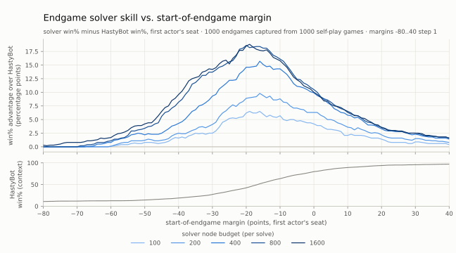
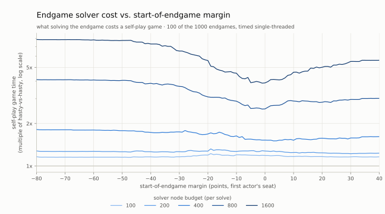

# Endgame solver benchmark results

Measurements from `endgame_bench` (see `engine/apps/endgame_bench.cpp`) on the
development machine (Docker container, NWL23 lexicon, Release build). They
characterize the `hastybot-endgame` agent as a function of the solver's node
budget (default 400).

**Hardware**: Intel Core i7-13850HX (28 hardware threads), 64 GB RAM, inside
the project's Docker container, Release build.

## Methodology

We measure the endgame solver along two dimensions: **skill** and **cost**.

Both come out of one sweep. Each seeded HastyBot-vs-HastyBot game's first
bag-empty position is captured, and every captured position is replayed once per
(margin, budget) cell: a synthetic score margin m sets the first actor's scores
to (m, 0), an EndgameHastyBot takes that seat, and a plain HastyBot replies,
projections respected as in self-play generation. Both agent types decide off
spread alone, so the margin fully defines the position, and comparing the solver
seat's result against the hasty baseline's from the identical seat isolates the
solver's effect. HastyBot's moves are score-independent, so one hasty playout
per game fixes the baseline at every margin.

The margin axis is asymmetric -- [-80, +40] -- because hasty's own win% is not
symmetric about zero: it is already 80% at margin 0 and 97% by +40, so the
contested region sits below zero and that is where the axis is spent.

**Skill** is the solver seat's win% minus the hasty baseline's at the same
margin (a win counts 1, a draw 0.5). Win% rather than spread: under the
production `spread_matters=false` setting the solver optimizes the win/draw/loss
class and stops at its proof, so spread is not a quantity it is trying to move
(only its fallback, when the proof does not land, is).
Skill is deterministic -- greedy tie-breaks are fixed, so each cell is a pure
function of the position, margin, and budget -- and it is averaged over all
1000 games.

**Cost** is measured, not modeled: `EndgameHastyBotAgent` times its own
`solve()` calls and the sweep sums them over a playout. It is quoted not in
milliseconds but as a multiple of a plain HastyBot-vs-HastyBot game timed under
the same conditions (4.14 ms/game here) -- what solving the endgame costs
self-play generation, which is the question the budget ladder is being asked,
and the same currency as the whole-game throughput section below. 1.00x is a
free endgame.

Because a wall-clock number is only worth reporting when nothing else is
competing for cores, caches, and clock, the first `--time-games` games and the
baseline are run alone on a single thread, and they are the only ones the cost
curve reads; the rest run across all workers and contribute only their
(deterministic) spreads. This is the one reported number that is not
reproducible bit-for-bit.

The sweep exploits one redundancy, the **budget-nesting skip**: at a fixed
margin, budgets run in descending order, and once a run's deepest solve stayed
under a smaller budget b', re-running at b' is bit-identical -- so its result and
its measured time stand for b' as well. It fills about half the grid (310,315 of
605,000 cells in the run below). A second redundancy is left on the table: a
solve depends on the margin only through the fixed +/-1 class window, so
neighbouring margins usually execute identically -- 88% of adjacent pairs in a
20-game probe at budget 1600, which would collapse roughly 8 cells into 1.
Harvesting it means a certificate of the margin interval a solve is invariant
over, which means threading margin-sensitivity through every comparison in the
search: not worth it while the full sweep runs in 11 minutes.

`--incremental=0` disables the solver's incremental move-list maintenance
(PathMoveLists) for A/B runs. It changes speed but no result: every skill number
below is bit-identical under both settings.

## Skill vs hasty

1000 games, seed 1. y is the solver seat's win% minus the hasty baseline's win%
at the same margin -- "+10" means the solver wins 10 points more often than
hasty does from the identical seat. The lower panel carries hasty's own win% for
context.



Readings:

- Skill concentrates where the game is contested and vanishes at both extremes:
  decided endgames are converted equally by everyone.
- The peak sits at slightly-losing margins (+18.8 at margin -19, budget 1600),
  not at 0. The solver rescues games hasty loses more than it protects games
  hasty already wins, because hasty's baseline is already 80% at margin 0.
- Even the smallest budget buys real skill (+6.2 at margin -20, budget 100).
- Skill saturates above budget 800. 1600 leads across the losing half of the
  axis -- +14.2 vs +13.7 at margin -30, +18.8 vs +18.2 at the peak -- but the
  two curves sit within 0.7 points of each other everywhere in [-17, +6], where
  800 sometimes leads. Doubling past 800 buys a fraction of what doubling to it
  did.

**Why the fallback exists.** A class-only search that proves nothing still has
to return a move, and the move it has is ranked by a bound rather than by
points; deepening only reshuffles such moves. Playing them made the budget
ladder run backwards -- 1600 scored *below* 800 across the whole contested band,
+11.5 vs +13.2 at margin -30 -- and instrumenting the 45 games the two budgets
disagreed on put 43 of them in the class-unknown bucket, so the effect was
entirely in the unproven path and not in how proven positions were handled.
Hence `EndgameSolver::solve_class_first` spends the reserved half of the budget
on a spread pass when the proof does not land, which is what the
`spread_matters` driver always did. Measured at margin -30, 1000 games:

| class-only driver | 200 | 400 | 800 | 1600 |
|---|---|---|---|---|
| narrow-window move when unproven | +4.2 | +9.4 | +13.2 | +11.5 |
| spread fallback when unproven | +4.1 | +9.3 | +13.7 | **+14.2** |

Two variants ruled out the other candidate explanations, both to do with proven
losses rather than unproven positions: conceding one through its certificate
instead of playing it out is worth +0.1 (`--projections=0`), and handing lost
positions to HastyBot instead of playing the solver's arbitrary class-equal move
is worth +0.2. Neither restored monotonicity; the fallback did.

## Cost

What one self-play game costs when its endgame is solved, as a multiple of a
hasty-vs-hasty game (see Methodology), log scale. 1.00x is free.



Readings:

- Cost is lowest near the middle and at winning margins, and peaks at
  deep-losing margins: 7.88x at margin -80 vs 3.88x at margin 0, budget 1600.
- A win verdict rests on a single winning line, so the root scan cuts off the
  moment one is found; a loss proof must refute every root move, and at the
  endgame's first positions both racks are full, so the out-play futility sets
  are empty and nothing prunes the refutation.
- The curve flattens below margin -40: from there down the position is lost
  whatever the solver does, so the search is the same full refutation every
  time.
- Cost scales far faster than skill above budget 400. At margin -20, budget 800
  buys 4.0 points of skill over 400 and costs 1.8x more game time; 1600 gives
  0.1 of that back and costs 3.3x more.
- Skill per unit of generation time picks out 200 and 400 together: +8.9 at
  1.20x and +14.6 at 2.00x are the same 7.4 and 7.3 points per multiple of a
  hasty-vs-hasty game, against 4.7 at budget 800 and 2.5 at 1600. **400 is the
  shipped default** -- the last rung before the returns collapse, and the side
  of that pair that buys strength rather than games, since a generator that
  optimizes win% rather than score margin should reach the bag-empty point
  contested more often than HastyBot does and put more weight on the band where
  the solver earns its keep.

## Whole-game throughput

`--mode=games --games=200 --seed=7 --threads=1` (projections respected, as
self-play generation runs) times endgame-vs-endgame self-play against the
hasty-vs-hasty baseline (~4.7 ms/game):

| budget | ratio (incremental on) | ratio (`--incremental=0`) |
|---|---|---|
| 100 | 1.05x | 1.10x |
| 200 | 1.20x | 1.41x |
| 400 | 2.00x | 3.08x |
| 800 | 3.99x | 7.15x |
| 1600 | 7.35x | 13.75x |

These are whole self-play games at their natural margins, so they sit in the
same currency as the cost figure above and near its mid-margin values. The
incremental maintenance roughly halves the solver's per-game overhead above the
hasty baseline (at budget 1600: 29.5 vs 59.5 ms/game of endgame overhead).
The same mode's head-to-head table reports each budget's win% and W/D/L record
against plain hasty, bucketed by baseline bag-empty spread; it is bit-identical
under both settings, and it saturates where the margin sweep says it should --
budgets 800 and 1600 post the same 52.0% overall and the same 54.2% in the 0-19
bucket.

## Proof certificates

Every class proof carries a certificate: the class-critical side's moves come
from fresh narrow-window re-proofs at each position of the walk, run over the
warm transposition table outside the node budget (tracked in
`EndgameResult::certificate_nodes`, negligible in practice), gated on a terminal
check that the walk lands on the proven class. This is enforced by the test
suite, plus curated GCG endgames under `engine/tests/data/` pinned to their
proven class and proof cost by `EndgameGcgCases`.

## Analyzing a single position

`endgame_tool --gcg FILE` solves one GCG endgame position (bag empty; the
mover's rack from a #RackN pragma, the opponent's derived from the board) with a
verbose trace of the machinery: the replier's out-play set, every root move's
block-or-outscore futility bound ("needs >= +X to reach a draw"), each deepening
iteration's verdict, the certificate walk, and the projected line.

## Reproducing

```
target/engine/endgame_bench --mode=endgames --games=1000 --seed=1 \
    --budgets=100,200,400,800,1600 --margin-min=-80 --margin-max=40 \
    --margin-step=1 --threads=24 --time-games=100 \
    > docs/data/endgame_margin_sweep.txt
py/tools/plot_endgame_bench.py docs/data/endgame_margin_sweep.txt
target/engine/endgame_bench --mode=games --games=200 --seed=7 \
    --threads=1 --budgets=100,200,400,800,1600
target/engine/endgame_tool  --gcg engine/tests/data/FOE.gcg
```

The ruled-out variants above are one margin of the same sweep, run with
`--projections=0`:

```
target/engine/endgame_bench --mode=endgames --games=1000 --seed=1 \
    --budgets=200,400,800,1600 --margin-min=-30 --margin-max=-30 \
    --threads=24 --time-games=0
```

The sweep takes about 11 minutes, most of it the single-threaded timing phase.
`docs/data/endgame_margin_sweep.txt` is the captured run the two figures are
drawn from, and the plot script regenerates them from it. Append
`--incremental=0` to either endgame_bench command for the scratch-generation
A/B.
