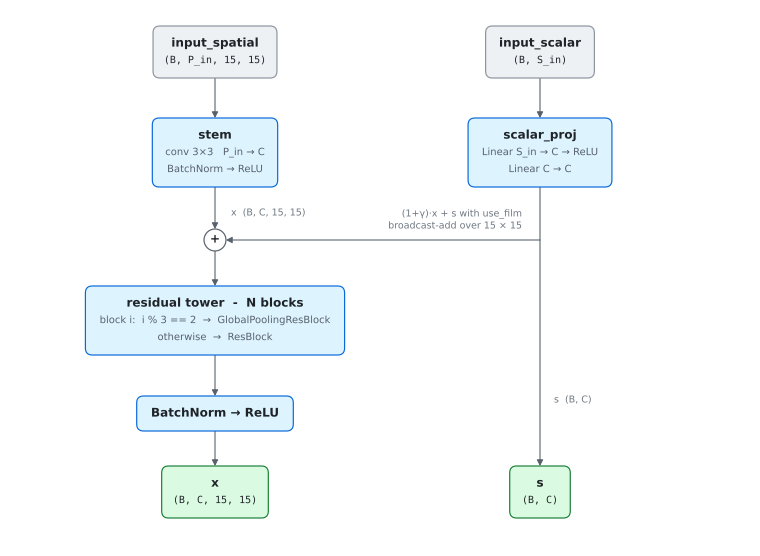
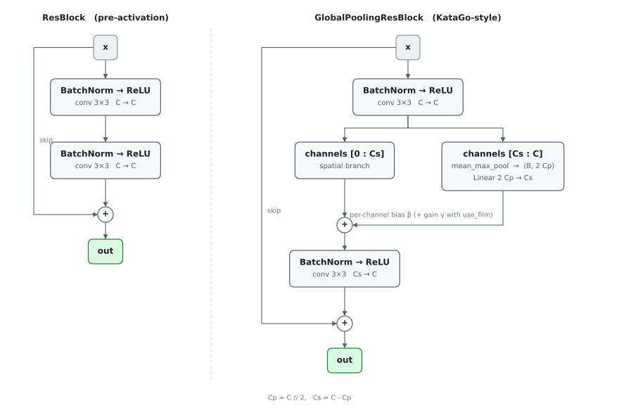
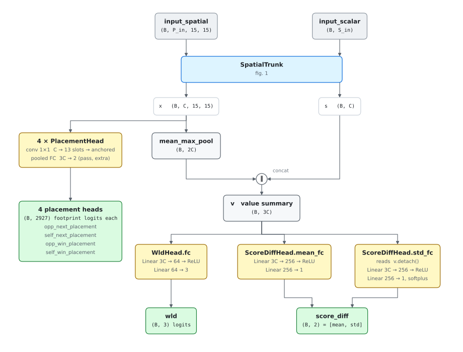
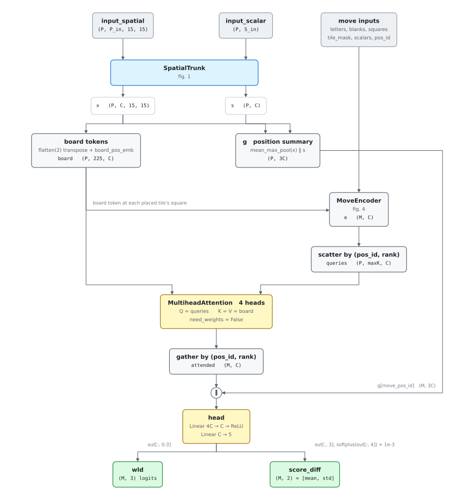
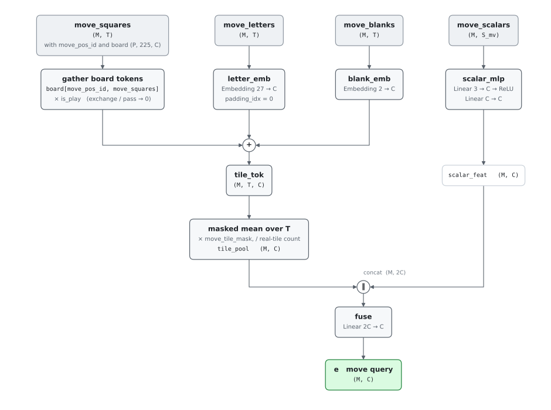
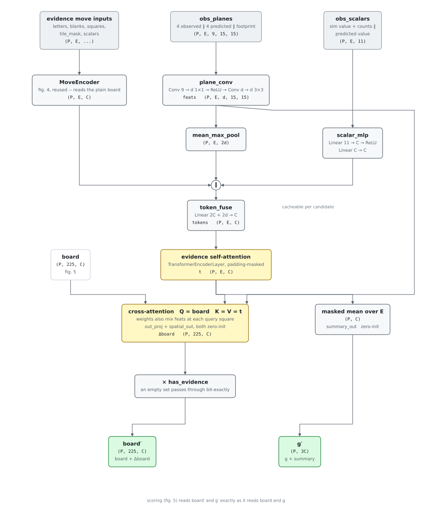

# Model architectures

Wiring diagrams for the two trained networks and the trunk they share.
Authoritative code:
[spatial_trunk.py](../py/scribblez/spatial_trunk.py),
[position_eval/model.py](../py/scribblez/position_eval/model.py),
[move_set_eval/model.py](../py/scribblez/move_set_eval/model.py).

> **Keep in sync.** An architecture change in either `model.py` belongs in the
> same commit as the corresponding change here. The figures are generated —
> edit [py/tools/plot_model_architectures.py](../py/tools/plot_model_architectures.py)
> and re-run it, never the SVGs.

Symbols used throughout:

| Symbol | Meaning | Default |
|--------|---------|---------|
| `C` | `trunk_channels` | 192 |
| `N` | `num_blocks` in the residual tower | 10 |
| `P_in` / `S_in` | spatial planes / scalar width of the board input | 85 / 936; 85 / 963 under the open-leaves arm |
| `B` | batch of board positions (`P` in move-set code) | — |
| `M` | candidate moves in a batch, flattened across positions | — |
| `T` | placed-tile slots per move (`kMoveMaxPlaced` = `RACK_SIZE`) | 7 |
| `E` | padded evidence tokens per position | — |
| `d` | `d_spatial`, the per-token spatial feature width | 32 |
| `‖` | concatenate along the channel/feature dim | — |

---

## 1. Shared spatial trunk

`SpatialTrunk` also accepts an optional compiled-lexicon module, which injects a
per-cell residual after the stem. That experiment is deprecated and is left out
of the diagram.

### FiLM conditioning (`use_film`)

By default every route from the non-spatial (scalar / board-global) features to
the board features is an **addition** — the stem injection (`x + s`) and each
global-pooling block's per-channel bias. Addition can only *shift* a cell's
features by a scalar-derived amount; it cannot *gate* one feature on another. So
the trunk has no way to say "the opponent holds letter L, so attend to L's
cross-check plane" — the multiplicative conjunction of a scalar and a board
feature is not in its vocabulary. Measured consequence: the face-up-leaves model
reads cross-check masks through a fixed tile-frequency prior and ignores the
opponent's leave (see `py/scripts/position_eval/probe_crosscheck_binding.py`).

`use_film` adds the missing multiplicative half at both injection sites
([FiLM](https://arxiv.org/abs/1709.07871)): alongside the additive term `β` the
scalars emit a per-channel gain `γ`, applied as `(1 + γ) · x + β`. The `γ`
projections are **zero-initialised**, so a FiLM trunk starts numerically
identical to the additive one and is a strict superset of it — training departs
from the additive solution only as the multiplicative capacity earns its way in.
The returned scalar projection `s` is the `β` half, unchanged for the heads.

`use_film` is off by default and currently wired only through
`PositionEvalModel`; the diagram shows the additive (default) form.

### Tower blocks

`mean_max_pool`, used by both the pooling block and the value heads,
concatenates the channel-wise mean and max over the board: `(B, C, H, W)` →
`(B, 2C)`.

---

## 2. `PositionEvalModel`

One board in, six heads out. `wld` is the inference head; the rest are auxiliary
training signal.

`ScoreDiffHead.std_fc` reads a **detached** `v`, so the std loss trains that
stack alone — never the trunk, never the mean.

### Placement heads (footprint-categorical)

The four placement heads are **categorical distributions over move footprints**,
not per-cell Bernoulli masks. A footprint is `(anchor, orientation, k)` — the
first newly-placed square, the play axis, and the tile count `k ∈ 1..7` — and it
covers "the first `k` empty cells from the anchor". Each head is a
`PlacementHead`: a `Conv2d(C → 13)` whose `(cell, slot)` flattening is
exactly `training_targets.h`'s anchored-class index, plus a pooled FC for the two
catch-all classes (`pass`, and the win heads' `not-win` / the plays heads'
dummy), giving `(B, 2927)` raw logits. The plays heads (`*_next_placement`)
distribute over footprints ∪ {pass}; the win heads (`*_win_placement`) over
{footprint ∧ win} ∪ {not-win}, a proper distribution whose collapse is
`Pr[covers cell ∧ that seat wins]`.

Training is **masked softmax cross-entropy** against the footprint class: an
engine-computed legality mask (a sound over-approximation — opp heads exact-ish
from the board, self heads opp-move-invariant; recomputed per row on replay)
drives illegal footprints to −∞ before the softmax, and the target class is
always kept first (the `−log(0)` guard). Softmax's conserved mass replaces the
per-cell BCE's drifting, easy-negative-diluted geometry — the loss-geometry fix
for the I13/M7 magnitude residuals. `mask_placement=False` is the
masked-vs-unmasked arm. The graph emits raw logits (`kIdentity`); every consumer
masks and softmaxes itself, and the dashboard/`.mset` collapse each head to the
old per-cell `(15, 15)` marginal (`Σ` footprint probability over covered cells)
so the distilled student and MC-truth pairing are unchanged.

### Tile-supply cross-attention (`use_supply_attention`)

The placement heads need to gate a square's cross-check letters on whether those
tiles are actually *available* — in the bag, the opponent's known leave, or the
mover's own rack. The convolutional trunk learns this poorly: cross-checks are a
per-square, per-letter **spatial** signal while availability is a global
per-letter **scalar**, and the two meet only through the trunk's per-channel
bias/FiLM injection. That composition is sample-expensive, so the model gates
common tiles on availability but falls back to a fixed frequency prior for rare
ones (e.g. a ~0.17 hook belief for a letter with zero copies unseen).

`use_supply_attention` inserts one cross-attention block on the post-trunk
feature map (`supply_attention.py`). Each of the 27 tiles becomes a **supply
token** carrying its per-seat availability (mover rack / unseen pool / opp
leave); every board square attends to the supply tokens, its **query** built
from the square's trunk features *and* its raw 52-plane cross-check vector, so
"which letters are legal here" is explicit and matches the tokens' learned
letter identities. A square hooking on S/Y then reads S- and Y-supply directly
and gates its placement belief on the graded counts — distinguishing
"available to me" from "available to the opponent", which a single gated input
plane cannot. The output projection is **zero-initialised**, so the block is
inert at init: a strict superset of the no-attention model, matching the
`use_film` convention. Off by default and wired only through `PositionEvalModel`;
requires the open-leaves arm (`face_up_leaves`), which supplies the opp-leave
block.

### Losses

| Head | Target | Loss | Weight |
|------|--------|------|--------|
| `wld` | one-hot win/draw/loss | cross-entropy | 1 |
| `score_diff[:,0]` | observed final differential | Huber (δ=10) | `lambda_sd` = 1 |
| `score_diff[:,1]` | `MAD_TO_STD · \|mean − target\|`, detached | Huber (δ=10) | `lambda_sd` = 1 |
| `*_next_placement` | footprint class index (+ legality mask) | masked softmax-CE | `lambda_next_placement` = 0.5 each |
| `*_win_placement` | footprint class index (+ legality mask) | masked softmax-CE | `lambda_win_placement` = 0.5 each |

`MAD_TO_STD = sqrt(π/2)` rescales the absolute-residual target so its optimum is
a Gaussian σ. The recipe carries no activation-magnitude restoring forces: BF16
serving ([fp16_safe_serving.md](fp16_safe_serving.md)) has FP32's exponent
range, so the trunk's activations are free to grow without any FP16 overflow to
guard against.

---

## 3. `MoveSetEvalModel`

Encode `P` boards once, score `M` candidate moves against them in the same pass.
Moves are flattened with no padding; each carries `move_pos_id ∈ [0, P)`.

Grouping the queries by position keeps one K/V copy per board, so attention's
`W_k`/`W_v` projections are amortized across candidates the same way the trunk
is. The padded `(P, maxK, C)` query grid is the only place padding appears.

### The placement-plane readout (roadmap item 1)

The fused per-move vector (attended embedding + position summary, `4C`) is
projected to one `C`-wide query per plane head and dotted against the 225
board tokens: cell `(h, n)` of the `(M, 4, 225)` logit output is
`query_h · board_token_n`. The contraction runs over the same padded
`(P, maxK)` grid as the cross-attention, so the board tokens are read once
per position. Head order is `training_targets.h`'s placement targets (the
FFI-served `PLANE_NAMES`), matching the teacher masks quantized into the
`.mset` records.

### The move encoder

`move_scalars = [resultant_score_diff, tiles/7, is_play]`; letters are A..Z with
a separate blank flag, so a natural tile and its blank twin share letter
semantics. Layout owned by
[move_set_encoder.h](../engine/include/training/move_set_encoder.h).

### Losses (distillation from the position-eval teacher)

| Head | Target | Loss | Weight |
|------|--------|------|--------|
| `wld` | teacher probabilities (M, 3) | soft cross-entropy | 1 |
| `score_diff[:,0]` | teacher mean | Huber (δ=10) | `lambda_sd` = 0.004 |
| `score_diff[:,1]` | teacher std | Huber (δ=10) | `lambda_sd` = 0.004 |
| `planes` | teacher masks, dequantized (M, 4, 225) | BCE-with-logits | `lambda_planes` = 1 |

Like the position-eval model, this recipe carries no activation-magnitude
restoring forces: BF16 serving ([fp16_safe_serving.md](fp16_safe_serving.md))
has FP32's exponent range, so nothing opposes the trunk's activation growth.

Plane targets exist only in stratified (training) records; the full-sweep
evaluation slice is plane-less, so its metrics stay value-based and the
plane-readout quality (`plane_bce`) is read on the stratified fallback
holdout.

Ranking metric: `win_equity = P(win) + 0.5·P(draw)`, applied identically to
student softmax and teacher probabilities.

### The evidence fusion stage (roadmap item 5)

An optional late-fusion stage ([evidence_fusion.py](../py/scribblez/evidence_fusion.py))
conditioning the scoring on the sims run so far at a decision point. Each
simmed candidate contributes one token: its move encoding (the MoveEncoder,
reused, reading the plain board tokens), a conv encode of nine spatial
channels — the four observed rollout-frequency planes and the model's own four
evidence-free predicted planes concatenated channel-wise, plus the footprint —
and eleven scalars pairing the sim's value estimate and rollout count with the
model's evidence-free value prediction. Feeding the predictions in as inputs
is what lets the encoder form the residual `k·(obs − prior)` rather than only
an observation-marginal correction.

Tokens self-attend, then the 225 board tokens cross-attend into them; the
value each square receives carries the token's own spatial feature at that
square, so the *where* in the evidence maps survives fusion. The stage
rewrites `board` and `g` between the trunk and the scoring machinery, which
reads the conditioned pair exactly as it reads the plain one — late fusion,
so at one decision point the trunk output, move encodings, and per-candidate
tokens are computed once and only self-attention + fusion + re-scoring run
per loop iteration.

All three output projections are zero-initialized and an empty evidence set
hard-gates the stage off, so a fresh model — and any evidence-free forward at
any weights — computes exactly the plain one-pass model.

Scale is pinned at the stage's seams: the fused tokens are LayerNorm'd before
the self-attention; the cross-attention's queries and keys are LayerNorm'd
per head (QK-norm) so its logits do not scale with the projection weights;
and `attended`, the per-square `local` mix, and the pooled summary are each
LayerNorm'd before their zero-init output projections. Without these the
first evidence run's tokens grew 40× at peak LR while its loss stood still,
its board rewrite outgrew the trunk map, and the frozen scoring attention
reading that map blew the gradients up (see the trainer's clipping and
divergence guards in `scribblez.evidence.train_loop` / `trainer`). Training data comes
from evidence trajectories (`.sobs` observations paired with live-recomputed
first-pass predictions, roadmap item 4).

### The proves-best head (roadmap item 5)

`proves_best`: a small softplus MLP off the same fused per-move vector as
`head` and `plane_proj`, taking additionally the scalar **best-so-far** (the
max sim value over the evidence set gathered so far — a known input at
inference), output `gain` (M,) ≥ 0 — the expected improvement
`E[max(0, v − best-so-far)]` a sim of that candidate would contribute over the
best simmed so far. Feeding best-so-far in directly is what lets the head
compare against it, rather than reconstructing a max from the mean-pooled
evidence summary. Meaningful only under evidence (at the empty set it collapses
to the value itself); exported by the `move_proposal_step` graph of the
evidence path (roadmap item 3, §4 below).

### Training the evidence path (`scribblez.evidence`)

> **Plan status.** The modes below are what the code implements today. The
> gen-1 frozen-mode trial over the 200-rollout trajectory corpus is the
> recorded floor (conditioned − plain soft-CE −0.0008; acquisition hit rate
> 0.57 vs the plain value's 0.61). Item 5 revises this into the **move
> proposal model**: a student copy with a **trainable backbone**, trained
> gain-first (best-so-far fed as a head input) with the sim-outcome conditioned
> auxiliaries and **no self-distillation anchor** — the `.mset` distillation
> stream is dropped — over a deployment-rollout-count corpus of
> subset-assembled evidence sets ([roadmap.md](roadmap.md) items 2–5).

The fusion stage and the proves-best head train over the student. In the
default **frozen** mode (`freeze_backbone`: everything outside
`evidence_fusion` / `proves_best` is `requires_grad=False` and pinned to eval
mode, so the trunk's BatchNorm keeps its student statistics) they are all
that learns. Rows are (position, evidence prefix, held-out simmed candidate)
from trajectory `.sobs`; the targets are the held-out candidate's sim
outcomes, not teacher readouts (docs/roadmap.md item 5 explains why):

| Head | Target | Loss | Weight |
|------|--------|------|--------|
| `wld` (conditioned) | sim W/D/L frequencies | soft cross-entropy | 1 |
| `score_diff` (conditioned) | sim delta mean / std | Huber (δ=10) | `lambda_sd` = 0.004 |
| `gain` | `max(0, v_c − max prefix v)`, CRN-paired | Huber (δ=0.05) | `lambda_gain` = 1 |

In the **unfrozen** mode (`unfreeze_backbone`) the whole model trains and
every step is joint: the rows above (their total weighted by `lambda_sim`,
default 1) plus one batch of the same games' `.mset` teacher labels through
the plain pass — the student's own distillation objective, which anchors the
plain pass while the sim rows train the conditioned one:

| Head | Target | Loss | Weight |
|------|--------|------|--------|
| `wld` (plain) | teacher W/D/L | soft cross-entropy | 1 |
| `score_diff` (plain) | teacher mean / std | Huber (δ=10) | `lambda_sd` = 0.004 |
| `planes` (plain) | teacher placement planes | per-cell BCE | `lambda_planes` = 1 |

Two AdamW groups: the evidence path (fusion + proves-best head, from
zero-init / random) at `lr`, the backbone at `lr × backbone_lr_mult`
(default 0.1) — the WSD schedule scales both. BatchNorm runs in train mode.
The plain first pass that feeds the evidence tokens is read without
gradients in either mode (it is an input, not a training path); prefix-0
exactness holds between the current plain and conditioned passes since the
fusion's gate is structural. The plain student is exported per pass as ONNX
in this mode only.

Gradients over the trainable params are clipped to `grad_clip` (default 1)
per step; a batch with a non-finite loss or gradient takes no step and is
counted, and a pass that leaves non-finite parameters or skips more than a
handful of batches stops the run before anything is checkpointed.

Held-out metrics compare the conditioned pass with the plain one on the same
rows (soft-CE, value MAE), report the gain error and the acquisition hit rate
(argmax gain over a position's held-out candidates vs. the one that simmed
best; the plain value's argmax is the baseline), and read prefix-0 rows as the
exactness check. Unfrozen, the frozen student's soft-CE on the same rows is
added as a flat reference (`student_wld_ce`), and the `.mset` holdout's
recall@1 / Spearman / plane BCE / distillation loss (`distill_*`) watch the
plain pass for drift.

---

## 4. Side by side

|  | `PositionEvalModel` | `MoveSetEvalModel` |
|--|---------------------|--------------------|
| Trunk | `SpatialTrunk`, shared implementation | same |
| Unit of output | one board | one candidate move |
| Board encodes per output | 1 | 1 / candidate-set |
| Move-conditioning | none (board is post-move) | tile embeddings + cross-attention |
| Heads | wld, score_diff, 4 footprint placement heads | wld, score_diff, 4 placement planes, proves-best gain |
| Supervision | game outcomes / observed spread | teacher readouts (`.mset` sidecar) |
| ONNX outputs | `wld`, `score_diff`, 4 footprint-logit heads | plain graph: `wld`, `score_diff`; evidence-path split (below) adds `planes` and `gain` |

The move set evaluation model has two ONNX export paths. The plain graph
(`onnx_export.py`, `move_set_eval`) emits `wld` and `score_diff` for the
one-pass agent. The evidence path (`proposal_export.py`, roadmap item 3) splits
the move proposal model into two graphs the engine runs incrementally
(docs/sim_residual_feedback.md), and these emit the placement `planes` and the
proves-best `gain` that the plain graph omits:

| graph | run | inputs | outputs |
|-------|-----|--------|---------|
| `move_proposal_cache` | once per turn | board + `M` candidates | `board (1,225,C)`, `g (1,3C)`, `move_enc (M,C)`, plain `wld`, `score_diff`, `planes` |
| `move_proposal_step` | per evidence-loop iteration | the cache tensors + a padded width-`E` evidence set | evidence-conditioned `wld`, `score_diff`, `planes`, `gain` |

The engine runtime for these graphs is `agent/move_proposal_runtime.h`
(`NeuralNet<MoveProposalCacheSpec>` + `NeuralNet<MoveProposalStepSpec>`), served
at FP32 for item 3 and verified against `MoveSetEvalModel.forward` by
`test_proposal_inference_parity.cpp`.
