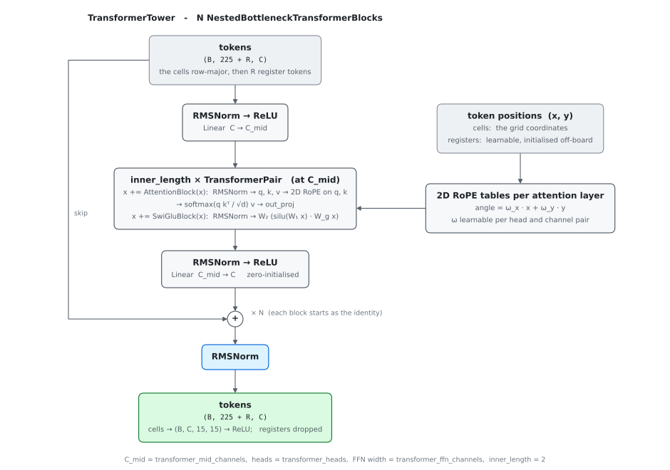

# Model architectures

Wiring diagrams and loss tables for the two trained networks and the spatial
trunk they share, for anyone reading or changing the model code. What the
models are *for*, and in what order they are trained, is in
[roadmap.md](roadmap.md). Authoritative code:
[spatial_trunk.py](../py/scribblez/spatial_trunk.py),
[position_eval/model.py](../py/scribblez/position_eval/model.py),
[move_set_eval/model.py](../py/scribblez/move_set_eval/model.py).

> **Keep in sync.** An architecture change in either `model.py` belongs in the
> same commit as the matching change here. The figures are generated: edit
> [py/tools/plot_model_architectures.py](../py/tools/plot_model_architectures.py)
> and re-run it, never the SVGs.

Symbols used throughout:

| Symbol | Meaning | Default |
|--------|---------|---------|
| `C` | `trunk_channels` | 192 |
| `N` | `num_blocks` in the tower | 10 |
| `C_mid` | `transformer_mid_channels`, the width inside a transformer-tower block | 192 |
| `R` | register tokens appended to the transformer tower's cell sequence (the 27 tile-supply tokens) | 27 |
| `P_in` / `S_in` | spatial planes / scalar width of the board input | 87 / 136; 87 / 163 under the open-leaves arm |
| `B` | batch of board positions (`P` in move-set code) | — |
| `M` | candidate moves in a batch, flattened across positions | — |
| `T` | placed-tile slots per move (`kMoveMaxPlaced` = `RACK_SIZE`) | 7 |
| `E` | padded evidence tokens per position | — |
| `d` | `d_spatial`, the per-token spatial feature width | 32 |
| `‖` | concatenate along the channel/feature dim | — |

A **footprint** recurs below: the squares a move newly covers, identified as
`(anchor, orientation, k)`, meaning the first `k ∈ 1..7` empty cells from the
anchor square along the play axis. There are 2927 footprint classes: 225
anchor cells × 13 slots (one orientation-free slot for `k = 1`, then
`k = 2..7` for each orientation), plus two catch-all classes (pass, and a
second whose meaning depends on the head). The class layout is owned by
[footprint.h](../engine/include/training/footprint.h).

---

## 1. Shared spatial trunk

`SpatialTrunk` also accepts an optional compiled-lexicon module, which injects a
per-cell residual after the stem. That experiment is deprecated and left out
of the diagram.

### FiLM conditioning (`use_film`)

By default every route from the scalar (board-global) features into the board
features is an **addition**: the stem injection (`x + s`) and each
global-pooling block's per-channel bias. Addition can only shift a cell's
features by a scalar-derived amount; it cannot gate one feature on another.
So the trunk cannot express "the opponent holds letter L, so attend to L's
cross-check plane". Measured consequence: the face-up-leaves model reads
cross-check masks through a fixed tile-frequency prior and ignores the
opponent's leave (`py/scripts/position_eval/probe_crosscheck_binding.py`).

`use_film` adds the missing multiplicative half at both injection sites
([FiLM](https://arxiv.org/abs/1709.07871)): alongside the additive term `β`,
the scalars emit a per-channel gain `γ`, applied as `(1 + γ) · x + β`. The `γ`
projections are zero-initialised, so a FiLM trunk starts numerically identical
to the additive one and departs from it only as the multiplicative capacity
earns its way in. The scalar projection `s` returned to the heads is the `β`
half, unchanged.

`use_film` is off by default and wired only through `PositionEvalModel`; the
diagram shows the additive form. What it did and did not fix is in
[film_conditioning_results.md](film_conditioning_results.md).

### Tower blocks

`mean_max_pool`, used by both the pooling block and the value heads,
concatenates the channel-wise mean and max over the board:
`(B, C, H, W)` → `(B, 2C)`.

### Transformer tower (`trunk = transformer`)

The conv tower reasons spatially through stacked 3×3 convolutions and
re-broadcasts board-global context through its global-pooling blocks. The
transformer tower ([transformer_tower.py](../py/scribblez/transformer_tower.py))
replaces both, mirroring the trunk of KataGo's released transformer nets (its
`NestedBottleneckTransformerBlock`).

The stem is unchanged. After the scalar injection, the `15×15` feature map
becomes a sequence of 225 cell tokens. Each of the `N` blocks:

1. projects the trunk stream down to `C_mid` (`RMSNorm → ReLU → Linear`);
2. runs two (self-attention, SwiGLU FFN) pairs at that width, each on its own
   residual;
3. projects back up (`RMSNorm → ReLU → Linear`). This projection is
   zero-initialised, so every block starts as the identity on the trunk
   stream.

A final RMSNorm, the cells laid back onto the board, and a ReLU give the heads
the same `(B, C, 15, 15)` map the conv tower does. There are no global-pooling
blocks, since attention already sees the whole board.

Position enters through 2D rotary embeddings on the queries and keys. Each
channel pair of a head is rotated by `ω_x·x + ω_y·y` with per-head, per-pair
**learnable** frequencies, initialised log-uniform between one radian per cell
and one per fifty cells, so a head can become as local or as global as it
needs. The board has no off-board cells, so none of KataGo's off-board masking
is needed.

The sequence may carry `R` **register tokens** after the cells: extra tokens
the model supplies, with learnable 2D positions initialised just off the
board's left edge, which every attention layer sees alongside the cells.
`PositionEvalModel` and `MoveSetEvalModel` fill them with the tile-supply
tokens of §2.

`trunk_channels` and `num_blocks` keep their meaning (`C` and `N`);
`transformer_mid_channels`, `transformer_heads` and `transformer_ffn_channels`
size the inside of a block. Both models select the tower with their workload's
`trunk` param, and the `transformer` and `conv` parameter profiles pick an arm
together with its recipe (the transformer profile adds `grad_clip = 1`). The
per-lane model always uses the conv tower.

---

## 2. `PositionEvalModel`

One board in, six heads out. `wld` is the inference head; the rest are
auxiliary training signal.

`ScoreDiffHead.std_fc` reads a **detached** `v`, so the std loss trains that
stack alone, never the trunk or the mean.

### Placement heads

The four placement heads are **categorical distributions over footprints**.
Each is a `PlacementHead`: a `Conv2d(C → 13)` whose `(cell, slot)` flattening
is exactly `training_targets.h`'s anchored-class index, plus a pooled FC for
the two catch-all classes, giving `(B, 2927)` raw logits.

- The plays heads (`*_next_placement`) distribute over footprints ∪ {pass}:
  where that seat's next move lands. Their second catch-all is an unused
  dummy.
- The win heads (`*_win_placement`) distribute over
  {footprint ∧ that seat wins} ∪ {not-win}. Summed over the footprints
  covering a cell, this is `Pr[covers cell ∧ that seat wins]`.

Training is **masked softmax cross-entropy** against the footprint class. The
engine computes a legality mask per row on replay: a sound over-approximation,
near-exact for the opponent heads, and for the self heads invariant to the
opponent's intervening move. Illegal footprints go to −∞ before the softmax,
and the target class is always kept, so the loss is never `−log(0)`. A softmax
conserves probability mass across footprints; the obvious alternative, a
per-cell BCE mask, lets total mass drift and is dominated by easy negatives,
which is what left the per-cell heads with systematic magnitude errors on the
test positions.

The exported graph emits raw logits (`kIdentity`), and every consumer masks
and softmaxes for itself. The `.mset` teacher target stores the masked
footprint distribution directly, so the student distills in footprint space.
Only the dashboard reduces a head to a per-cell `(15, 15)` marginal (summing
footprint probability over the covered cells), for the human occupancy view.

### Tile-supply register tokens (transformer trunk)

The placement heads need to gate a square's cross-check letters on whether
those tiles are actually available: in the bag, in the opponent's known leave,
or on the mover's own rack. The conv trunk learns this poorly. Cross-checks
are a per-square, per-letter **spatial** signal, availability is a global
per-letter **scalar**, and the two meet only through the trunk's per-channel
bias or FiLM injection. That composition is sample-expensive, so a conv model
gates common tiles on availability but falls back to a fixed frequency prior
for rare ones (for example, a ~0.17 hook belief for a letter with no copies
unseen).

Under the transformer trunk each of the 27 tiles becomes a register token
([supply_registers.py](../py/scribblez/supply_registers.py)): a learned
per-tile identity embedding plus a projection of that tile's per-seat
availability counts (the mover's rack; the unseen pool, decoded from its
thermometer encoding; and under the open-leaves arm, the opponent's known
leave). A square that hooks on S or Y then reads S and Y supply directly in
every attention layer, graded by the actual counts and distinguishing
"available to me" from "available to the opponent", which a single gated
input plane cannot. `MoveSetEvalModel`'s transformer arm carries the same
tokens, because its placement readout (§3) distills these heads and has the
same gating to learn.

### Losses

| Head | Target | Loss | Weight (workload default) |
|------|--------|------|--------|
| `wld` | one-hot win/draw/loss | cross-entropy | `lambda_wld` = 1 |
| `score_diff[:,0]` | observed final differential | Huber (δ=10) | `lambda_sd` = 0.0002 |
| `score_diff[:,1]` | `MAD_TO_STD · \|mean − target\|`, detached | Huber (δ=10) | `lambda_sd` = 0.0002 |
| `*_next_placement` | footprint class index (+ legality mask) | masked softmax-CE | `lambda_next_placement` = 0.5 each |
| `*_win_placement` | footprint class index (+ legality mask) | masked softmax-CE | `lambda_win_placement` = 0.5 each |

`MAD_TO_STD = sqrt(π/2)` rescales the absolute-residual target so its optimum
is a Gaussian σ.

Neither model's recipe carries a penalty on activation magnitude. They are
served in BF16, which has FP32's exponent range, so the trunk's activations
may grow without risk of overflow
([fp16_safe_serving.md](plans/fp16_safe_serving.md)).

---

## 3. `MoveSetEvalModel`

Encode `P` boards once, then score `M` candidate moves against them in the same
pass. Moves are flattened with no padding; each carries
`move_pos_id ∈ [0, P)`.

Grouping the queries by position keeps one K/V copy per board, so attention's
`W_k`/`W_v` projections are amortized across candidates the same way the trunk
is. The padded `(P, maxK, C)` query grid is the only place padding appears.

### The placement readout

The fused per-move vector (attended embedding + position summary, `4C`) is
projected to 13 (`SLOTS_PER_CELL`) `C`-wide queries per placement head, each
dotted against the 225 board tokens: the logit for `(head, cell, slot)` is
`query_(head, slot) · board_token_cell`. Flattened in that order these are
the anchored footprint classes (`class = cell·13 + slot`); a small direct head
adds the two catch-all classes, giving four footprint distributions
`(M, 4, 2927)`. This is the teacher's `Conv(C → 13)` head recast in the
student's per-move cross-attention form. The contraction runs over the same
padded `(P, maxK)` grid as the cross-attention, so the board tokens are read
once per position. Head order is `PLANE_NAMES` as the FFI serves it, matching
the teacher distributions quantized into the `.mset` records.

The evidence path (below) reads these distributions as per-slot board
channels (`footprint_slot_planes`): softmax, drop the catch-alls, and lay each
head's 13 slots out as 13 `15×15` channels.

### The move encoder

`move_scalars = [resultant_score_diff, tiles/7, is_play]`. Letters are A..Z with
a separate blank flag, so a natural tile and its blank twin share letter
semantics. The layout is owned by
[move_set_encoder.h](../engine/include/training/move_set_encoder.h).

### Losses (distillation from the position evaluation teacher)

| Head | Target | Loss | Weight |
|------|--------|------|--------|
| `wld` | teacher probabilities (M, 3) | soft cross-entropy | 1 |
| `score_diff[:,0]` | teacher mean | Huber (δ=10) | `lambda_sd` = 0.004 |
| `score_diff[:,1]` | teacher std | Huber (δ=10) | `lambda_sd` = 0.004 |
| `planes` | teacher footprint distributions, dequantized (M, 4, 2927) | soft softmax cross-entropy | `lambda_planes` = 1 |

Plane targets exist only in stratified (training) records. The full-sweep
evaluation slice carries none, so its metrics are value-based, and the
placement readout's quality (`plane_ce`) is read on the stratified fallback
holdout.

Ranking metric: `win_equity = P(win) + 0.5·P(draw)`, applied identically to
student and teacher probabilities.

### The evidence fusion stage

An optional late-fusion stage
([evidence_fusion.py](../py/scribblez/evidence_fusion.py)) that conditions the
scoring on the sims run so far at a decision point. It belongs to the move
proposal model ([roadmap.md](roadmap.md) item 5).

Each simmed candidate contributes one token, built from:

- its move encoding (the MoveEncoder, reused);
- a conv encode of 117 spatial channels: the four observed rollout-frequency
  footprint histograms and the model's own four evidence-free predicted
  footprint distributions (each head as 13 slot channels), plus the
  candidate's own footprint as a one-hot in a final 13;
- eleven scalars: the sim's W/D/L frequencies, spread moments and rollout
  count, beside the model's evidence-free value prediction.

Feeding the predictions in as inputs is load-bearing: with observations alone
the encoder can express `prior + g(obs)` but not the residual
`prior + k·(obs − prior)`. The channel layout is canonical in
`EVIDENCE_PLANE_NAMES`, and the engine's staging
([evidence_staging.h](../engine/include/agent/evidence_staging.h)) mirrors it.

Tokens self-attend, then the 225 board tokens cross-attend into them. The
value each square receives carries the token's own spatial feature at that
square, so *where* the evidence says something survives fusion. The stage
rewrites `board` and `g` between the trunk and the scoring machinery, which
reads the conditioned pair exactly as it reads the plain one. Because this is
late fusion, the trunk output, the move encodings and the per-candidate tokens
are computed once per decision point, and only self-attention, fusion and
re-scoring run per loop iteration.

All three output projections are zero-initialized and an empty evidence set
hard-gates the stage off, so a fresh model, and any evidence-free forward at
any weights, computes exactly the plain one-pass model.

Scale is pinned at the stage's seams. The fused tokens are LayerNorm'd before
self-attention; the cross-attention's queries and keys are LayerNorm'd per
head (QK-norm), so its logits do not scale with the projection weights; and
`attended`, the per-square `local` mix and the pooled summary are each
LayerNorm'd before their zero-init output projections. Without these, the
tokens of the first evidence run grew 40× at peak LR while its loss stood
still, the board rewrite outgrew the trunk map, and the frozen scoring
attention reading that map blew up the gradients. The trainer's clipping and
divergence guards (below) are the second line of defense.

### The proves-best head

`proves_best` is a small softplus MLP reading the same fused per-move vector as
the value head and the placement readout (`4C`), plus the scalar
**best-so-far** (`4C + 1` in). It outputs `gain` (M,) ≥ 0: the expected
improvement `E[max(0, v − best-so-far)]` that simming the candidate would add
over the best candidate simmed so far.

Best-so-far is fed in directly because a mean-pooled evidence summary cannot
carry the max the target is measured from. It is not a separate model input:
each evidence token already carries its candidate's observed win and draw
frequencies, so `evidence_fusion.best_so_far` takes the max of the observed
win value over the set's real tokens (0 for the empty set, the floor the
training target is measured from). The `move_proposal_step` graph computes it
the same way in-graph, so the engine stages nothing for it. The head is
meaningful only with evidence; at the empty set it collapses to the value
itself.

### Training the evidence path (`scribblez.evidence`)

This trains the **move proposal model** of [roadmap.md](roadmap.md) item 5: a
copy of the student trained on sim outcomes, gain first, with the conditioned
value heads as auxiliaries and no distillation anchor. The roadmap has the
rationale and the recorded frozen-trial floor.

Rows are `(position, evidence subset, held-out simmed candidate)`, assembled
from trajectory `.sobs` pools. Each pool is drawn `subsets_per_pool` times per
pass, with the subset empty at rate `empty_fraction` (or uniform over sizes
when unset). Both are tag parameters because they set the rows-clock the LR
schedule runs on. The targets are the held-out candidate's sim outcomes, never
teacher readouts:

| Head | Target | Loss | Weight |
|------|--------|------|--------|
| `wld` (conditioned) | sim W/D/L frequencies | soft cross-entropy | 1 |
| `score_diff` (conditioned) | sim spread mean / std | Huber (δ=10) | `lambda_sd` = 0.004 |
| `gain` | `max(0, v_c − max subset v)`, CRN-paired | Huber (δ=0.05) | `lambda_gain` = 1 |

The trainer has two modes:

- **Frozen** (the default; `freeze_backbone`). Everything outside
  `evidence_fusion` and `proves_best` has `requires_grad=False` and is pinned
  to eval mode, so the trunk's BatchNorm keeps the student's statistics. Only
  the fusion stage and the proves-best head learn. This is the diagnostic
  that produced the recorded floor.
- **Unfrozen** (`unfreeze_backbone`), the move proposal model proper. The
  whole model trains on the same loss, with two AdamW groups: the evidence
  path (fusion + proves-best, from zero or random init) at `lr`, and the
  backbone at `lr × backbone_lr_mult` (default 0.1). The WSD schedule scales
  both, and BatchNorm runs in train mode. The placement readout is the
  exception: no sim loss reads it, so it receives no gradient and stays the
  student's, now reading a trunk that trains under it. The predicted half of
  every evidence token is still its output. The plain student is exported as
  ONNX each pass in this mode only.

There is no distillation anchor in either mode. The empty-subset rows keep the
plain pass calibrated on the simmed candidates. The plain first pass that
feeds the evidence tokens is read without gradients (it is an input, not a
training path), and because the fusion's gate is structural, the plain and
conditioned passes agree exactly at prefix 0.

Gradients over the trainable params are clipped to `grad_clip` (default 1) per
step. A batch with a non-finite loss or gradient takes no step and is counted;
a pass that leaves non-finite parameters, or skips more than a handful of
batches, stops the run before anything is checkpointed.

Held-out metrics compare the conditioned pass with the plain one on the same
rows (soft-CE, value MAE), report the gain error and the acquisition hit rate
(argmax gain over a position's held-out candidates against the one that simmed
best, with the plain value's argmax as the baseline), and check exactness on
prefix-0 rows. Unfrozen, the frozen student's soft-CE on the same rows is
added (`student_wld_ce`) as the flat reference the moving plain pass's drift
is read against.

---

## 4. Side by side

|  | `PositionEvalModel` | `MoveSetEvalModel` |
|--|---------------------|--------------------|
| Trunk | `SpatialTrunk`, shared implementation | same |
| Unit of output | one board | one candidate move |
| Board encodes per output | 1 | 1 per candidate set |
| Move conditioning | none (the board is post-move) | tile embeddings + cross-attention |
| Heads | wld, score_diff, 4 footprint placement heads | wld, score_diff, 4 footprint placement readouts, proves-best gain |
| Supervision | game outcomes and observed spread | teacher readouts (`.mset` sidecar); sim outcomes for the move proposal copy |
| ONNX outputs | `wld`, `score_diff`, 4 footprint-logit heads | plain graph: `wld`, `score_diff`; the evidence-path graphs (below) add `planes` and `gain` |

The move set evaluation model has two ONNX export paths. The plain graph
([onnx_export.py](../py/scribblez/move_set_eval/onnx_export.py)) emits `wld`
and `score_diff` for the one-pass agent. The evidence path
([proposal_export.py](../py/scribblez/move_set_eval/proposal_export.py),
roadmap item 3) splits the move proposal model into two graphs the engine runs
incrementally ([sim_residual_feedback.md](plans/sim_residual_feedback.md)):

| Graph | Run | Inputs | Outputs |
|-------|-----|--------|---------|
| `move_proposal_cache` | once per turn | board + `M` candidates | `board (1,225,C)`, `g (1,3C)`, `move_enc (M,C)`, plain `wld`, `score_diff`, `planes` |
| `move_proposal_step` | per evidence-loop iteration | the cache tensors + a padded width-`E` evidence set | evidence-conditioned `wld`, `score_diff`, `gain` |

The step graph emits no `planes`. The predicted planes in a simmed
candidate's evidence token are the evidence-free ones, taken from the cache
graph's output, and nothing reads a conditioned plane, so dropping the output
saves an `M × 11,700`-float buffer per engine.

In the engine, [move_proposal_nets.h](../engine/include/agent/move_proposal_nets.h)
holds the pair of networks (`NeuralNet<MoveProposalCacheSpec>` and
`NeuralNet<MoveProposalStepSpec>`, one shared serialized pair per run, created
by `MoveProposalNets::create()`).
[move_proposal_session.h](../engine/include/agent/move_proposal_session.h)
drives them, one session per consumer holding the retained position, behind
the GPU-free [move_proposal_service.h](../engine/include/agent/move_proposal_service.h)
interface the loop consumers program against. The pair is served at FP32 and
verified against `MoveSetEvalModel.forward` by
`test_proposal_inference_parity.cpp`.
