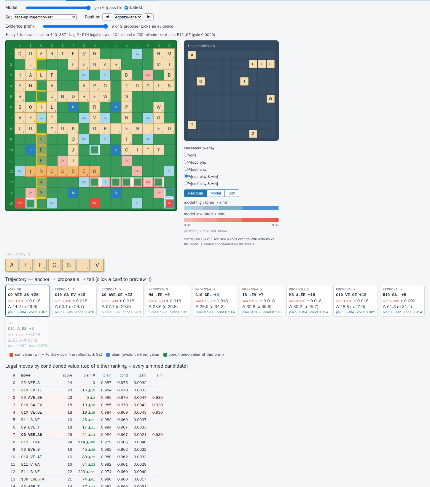

# React dashboard + training-analysis tabs

The training dashboard is a **React app with a Python data API**: a React
shell that embeds the Bokeh metric figures and hosts the genuinely
interactive tabs — the position-evaluation **Positions** board and the
max-move-per-lane **Lane analysis** board — as native React components.

## Why React + embedded Bokeh

The interactive Scrabble board is a React component
(`web/src/components/Board.tsx`), shared with the C++ web tools. A
Bokeh-served page cannot host it, so the page structure is React and the
metric plots are embedded into it via Bokeh's standalone embedding
(`json_item` on the server, `embed_item` in a small `<BokehFigure>` wrapper).
Plot-internal interactivity (scrubbers, sliders) is CustomJS, which survives
standalone embedding; page-level state (tag select, toggles, tabs) lives in
React. The BokehJS version in `web/` is pinned to match the Python `bokeh`
that produces the `json_item`s — they must move together.

## Architecture

Tornado (already present as a Bokeh dependency — FastAPI/Flask are not
installed) hosts the data API: it reads the tag's `dashboard.db` (SQLite,
task-aware via query params, one server serves any run) and builds Bokeh
`json_item`s in `plots.py`; figure endpoints dispatch by name to the plot
builders. In dev, Vite proxies `/api` to Tornado so the browser sees one
origin. The C++ web tools are unchanged; the dashboard only shares the
`web/src/components` library.

The training tabs render inside the master dashboard's task view
([master_dashboard.md](master_dashboard.md)), registered per workload in
`web/src/workloads.tsx`:

| Workload | Tabs |
|---|---|
| position_eval | Loss · Positions · Training · Controls · Info |
| max_move_per_lane | Loss · Lane analysis · Controls · Info |
| evidence_trajectories | Loss · Trajectories · Training · Controls · Info |

Loss/Training embed API figures and re-fetch when a cheap version token
advances; Positions, Lane analysis and Trajectories are the native interactive
tabs below.

## The position-evaluation Positions tab

Compares each model generation's prediction against a committed Monte-Carlo
ground truth over a GCG dataset
(`positions/NWL23/position-eval-test-dataset/`).

- **Dataset contract**: each `pos-N.gcg`'s penultimate move is a bingo (so
  the player to act drew a clean full rack); the analysis position is the
  board *after the final recorded move*, evaluated from the POV of the player
  who made it, with their leave as the rack.
- **Ground truth**: `monte_carlo_sim_tool` plays each position out ~10k
  times and commits exact W/L/D plus the final-score-delta histogram beside
  the GCGs.
- **Predictions**: an FFI replays the GCG into an input tensor byte-identical
  to a training row; the trainer's checkpoint hook evaluates the dataset
  batch per generation and writes WLD + score-delta mean/std into the tag's
  `dashboard.db`.
- **UI**: generation slider, position picker, board + leave; paired
  model-vs-MC WLD bars; the MC score-delta histogram with the model's
  Gaussian overlaid.

## The evidence-trajectories Trajectories tab

Shows the sequential evidence loop thinking on a hand-maintained position set
([positions/NWL23/face-up-trajectory-set](../positions/NWL23/face-up-trajectory-set/README.md)),
and the trained model's response to it (roadmap items 2–4).

- **Position sets**: a `.gcg` IS the position — its final recorded state,
  the side to move next, that side's rack from a `#RackN` pragma. Sidecars
  are simmed on first request under the tag's own proposer + recipe
  (`sim_evidence.position_sets.ensure_sobs`, cached under
  `<mount>/cache/trajectory_sets/`), so the tab shows exactly the
  trajectory the generator would produce there.
- **Model**: generation 0 is the frozen student itself (the tag's
  `student_checkpoint`); N is the trainer's per-pass torch checkpoint
  `checkpoints/model_epoch_{N-1}.pt`, run in torch on CPU
  (`scribblez.evidence.trajectory_view`). The FFI (`gcg_position_inputs`)
  rebuilds the decision the way the generator did — board row under the
  checkpoint's arm, pre-move differential, the full equity-ranked legal move
  list — the plain pass runs once per (checkpoint, position), and only the
  fusion + re-score run per evidence prefix.
- **UI**: generation slider, set/position pickers, an **evidence prefix**
  slider (0 … the proposer picks; the uniform tail is never evidence); the
  trajectory strip (anchor → proposals → tail, dimmed beyond the prefix,
  each card with its sim value ± SE, delta moments, plain and conditioned
  value); the board previewing the selected candidate with the Positions
  tab's placement overlay (sim count planes vs the conditioned pass's
  planes, residual | model | sim); and the legal moves re-ranked by the
  conditioned value with the plain rank shift, the proves-best gain, and
  the loop's **next sim** (argmax gain among the unsimmed) marked. At
  prefix 0 the conditioned pass equals the plain one by construction; at
  generation 0 conditioning is the identity and there is no gain column.
- The trainer's `posset_*` metrics (Training tab) score the same set at
  every prefix — the rank of the sim-best candidate under conditioned vs
  plain value — so what it charts is what this tab shows.

## The lane-analysis tab

Visualizes how each generation solves the max-move-per-lane task over a GCG
dataset (`positions/NWL23/max-move-per-lane-test-dataset/`).

- **Dataset contract**: each `pos-N.gcg` is a full game whose
  `#Rack1`/`#Rack2` headers are the racks at the *final* position; the
  on-move player (move-count parity) holds the full 7-tile rack, defining
  exactly one analysis position per file.
- **Ground truth**: replay to the final board, then per-lane targets plus a
  per-lane best-move enumeration (the moves tied for each lane's max, with
  word/coords/score).
- **Predictions**: a one-time FFI builder caches the dataset's input batch
  under the tag; the checkpoint hook decodes per-lane predictions (occupancy
  union, score PMF, has-move) into `dashboard.db` per generation.
- **UI**: generation slider, position picker, orientation radio;
  `Board.tsx` with per-lane pass/fail badges and lane highlighting; a
  lane-detail pane showing the true best move(s) and the true-vs-predicted
  tile-union diff; the selected lane's predicted score PMF with the true bin
  highlighted.
